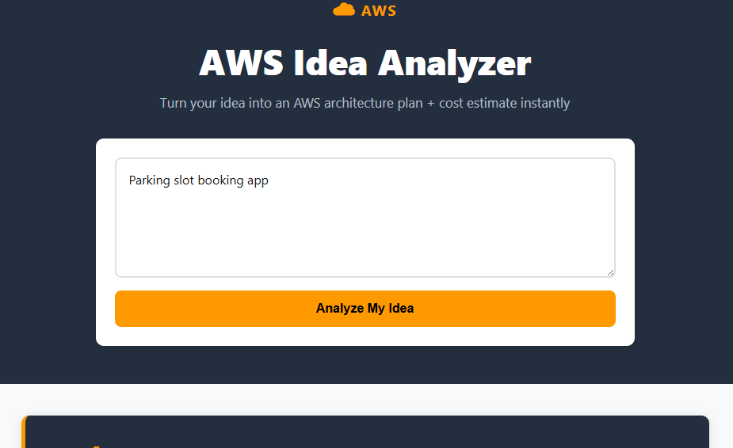
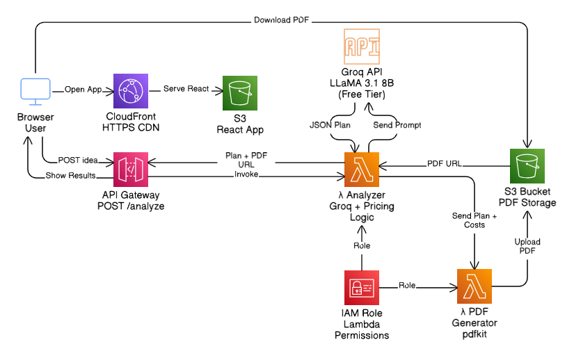

# ☁️ AWS Idea Analyzer

[](https://dmd0n0eytg6pu.cloudfront.net)


> Type any website idea → get an AI-generated development plan + downloadable AWS cost report PDF in seconds.



---

## 🧠 About the Project

Most developers struggle to estimate what AWS services they need and how much they'll cost before starting a project. **AWS Idea Analyzer** solves this by taking a plain-English idea and instantly producing:

- A **phase-by-phase development roadmap** powered by LLaMA 3.1 via Groq AI
- A **detailed AWS cost breakdown** with free tier callouts
- A **downloadable PDF report** generated serverlessly and stored on S3

No sign-up. No config. Just type and go.

---

## 🏗️ Architecture



---

## ⚙️ How It Works

1. User enters a website idea on the React frontend
2. React sends a `POST /analyze` request to API Gateway
3. API Gateway triggers the **Analyzer Lambda**
4. Analyzer Lambda sends a structured prompt to **Groq AI (LLaMA 3.1 8B)**
5. Groq returns a JSON plan — project name, summary, 4 phases, and recommended AWS services
6. Analyzer Lambda enriches the response with real AWS pricing data
7. Analyzer Lambda invokes the **PDF Generator Lambda**
8. PDF Lambda builds a styled report using `pdfkit` and uploads it to **S3**
9. A pre-signed S3 URL is returned to the frontend for one-click download

---

## ☁️ AWS Services

| Service | Role | Free Tier |
|---|---|---|
| **Amazon S3** | Frontend hosting + PDF storage | ✅ Yes |
| **CloudFront** | CDN + HTTPS for React app | ✅ Yes |
| **API Gateway** | REST API endpoint (`POST /analyze`) | ✅ Yes |
| **Lambda (Analyzer)** | Calls Groq AI, processes response, invokes PDF Lambda | ✅ Yes |
| **Lambda (PDF Generator)** | Generates cost report PDF with `pdfkit`, uploads to S3 | ✅ Yes |
| **IAM** | Least-privilege roles and policies for Lambda execution | ✅ Yes |

---

## ✨ Features

- 🤖 AI-generated development plans via LLaMA 3.1 (Groq)
- 📊 Per-service AWS cost breakdown with free tier highlights
- 📄 Downloadable PDF cost report, generated serverlessly
- ⚡ Sub-3-second response time via CloudFront + Lambda
- 📱 Fully responsive — works on mobile
- 🔒 IAM least-privilege security model throughout

---

## 🗂️ Project Structure

```
aws-idea-analyzer/
├── src/
│   ├── App.jsx          # React UI — input, loading, results, PDF download
│   └── App.css          # AWS-themed styles (navy + orange)
├── lambdas/
│   ├── analyzer/
│   │   └── index.mjs    # Groq AI call, pricing enrichment, PDF Lambda invoke
│   └── pdf-gen/
│       └── index.mjs    # pdfkit PDF generation + S3 upload
└── README.md
```

---

## 🚀 Local Setup (Frontend)

The backend runs entirely on AWS. To run the frontend locally:

```bash
git clone https://github.com/YOUR_USERNAME/aws-idea-analyzer.git
cd aws-idea-analyzer
npm install
npm run dev
```

Open [http://localhost:5173](http://localhost:5173).

> The app points to the live API Gateway endpoint by default, so it works out of the box.

---

## 🔐 Environment Variables (Lambda)

These are set directly on the Lambda functions via AWS Console or CLI — never committed to the repo.

| Variable | Description |
|---|---|
| `GROQ_API_KEY` | Groq API key for LLaMA 3.1 access |
| `PDF_BUCKET` | S3 bucket name where PDFs are stored |
| `PDF_LAMBDA_NAME` | Name of the PDF Generator Lambda to invoke |

---

## 💰 Cost

This project runs **almost entirely within the AWS Free Tier**:

- Lambda: 1M free requests/month
- S3: 5 GB free storage
- API Gateway: 1M free calls/month
- CloudFront: 1 TB free data transfer/month

The only potential cost is **Groq API** usage — which also has a generous free tier. For typical portfolio traffic, expect **$0/month**.

---

## 📚 What I Learned

- **Serverless architecture** — designing stateless, event-driven systems with Lambda and API Gateway
- **AI integration** — prompt engineering for structured JSON output from LLaMA 3.1 via Groq
- **PDF generation at the edge** — using `pdfkit` inside a Lambda with S3 as ephemeral storage
- **CloudFront + S3 hosting** — deploying a React SPA with CDN caching and HTTPS, no server needed
- **IAM least privilege** — scoping Lambda execution roles to only the permissions each function actually needs

---

## 👤 Author

**[Your Name]**
[](https://linkedin.com/in/YOUR_PROFILE)
[](https://github.com/YOUR_USERNAME)

---

<p align="center">Built with ☁️ on AWS · Powered by Groq AI</p>
